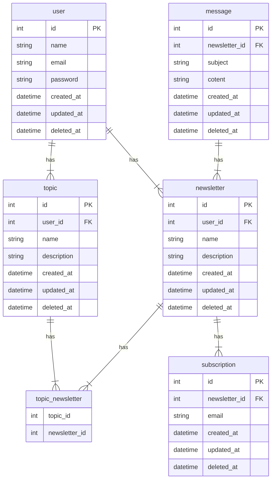

# Newsletter PHP

O Newsletter é um projeto pessoal de estudo que visa aplicar todos os meus conhecimentos no desenvolvimento de software, abrangendo aspectos de desenvolvimento, arquitetura, banco de dados e computação em nuvem. Como o nome sugere, trata-se de uma aplicação para gestão de listas de newsletters, permitindo a criação de várias listas com diferentes tópicos e a inscrição dos usuários em suas listas preferidas.

## Tecnologias / Conceitos utilizados:

* PHP 8.3
* Laravel 11
* Docker
* Docker Compose
* API Restful
* Documentação com Open API
* Testes automatizados
* Relatório de cobertura de testes
* Qualidade de código (PHP CS, PHP Stan)
* MySQL
* Redis

# Modelagem do banco de dados



# Desenvolvimento local

A seguir estão as instruções para executar o aplicativo em seu ambiente local utilizando Docker e Docker Compose.

### Configuração do Ambiente

Antes de começar, é necessário criar um arquivo .env com base no .env.example. Você pode fazer isso executando o seguinte comando no terminal:

```sh
cp .env.example .env
```

### Construção da Imagem Docker do PHP

Primeiro, navegue até o diretório docker

```sh
cd docker
```

Em seguida, construa a imagem Docker para o aplicativo executando o seguinte comando

```sh
docker build -t newsletter .
```

Execute seu docker-compose para subir toda a stack da aplicação

```sh
docker-compose up -d
```

### Chave para o Ambiente Local:

Em seguida, execute o comando para gerar uma chave do laravel para seu ambiente local
```sh
docker-compose exec app artisan key:generate
```

### Criação das Tabelas do Banco de Dados

Utilize o seguinte comando para gerar as tabelas do banco de dados:


```sh
docker-compose exec app artisan migrate
```

### Testes HTTP
Para verificar se todos os testes estão passando, execute o seguindo comando
```sh
docker-compose exec app artisan test
```
